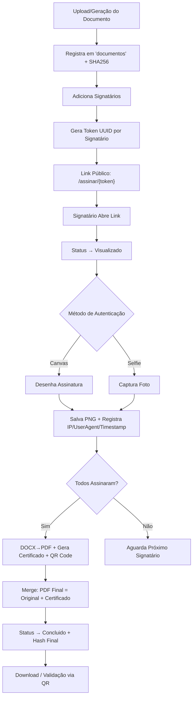

# Skill: ADVtools Sign (Assinatura Digital Própria)

Módulo nativo de assinatura eletrônica integrado ao ADVtools, eliminando dependência de APIs externas. Gerencia o ciclo completo:

1. Upload/Geração de Documento (DOCX/PDF).
2. Definição de Signatários (Nome, Email).
3. Envio de Links Únicos (Tokenizados via UUID).
4. Coleta de Autenticação (Desenho em Canvas **ou** Selfie via Câmera).
5. Geração de Certificado de Auditoria com QR Code.
6. Merge Final (PDF Original + Certificado).
7. Validação Pública via QR Code.

---

## 1. Arquitetura de Dados

### Tabela: `documentos`
Criada em `auto_setup_users()` dentro de `app.py` (linha ~1184).

```sql
CREATE TABLE IF NOT EXISTS documentos (
    id INTEGER PRIMARY KEY AUTOINCREMENT,
    escritorio_id INTEGER,
    cliente_id INTEGER,
    nome_arquivo TEXT,
    caminho_arquivo TEXT,      -- Caminho atualizado para o PDF final após conclusão
    token_assinatura TEXT UNIQUE,
    status TEXT DEFAULT 'Aguardando',  -- Aberto | Concluido
    data_criacao DATETIME DEFAULT CURRENT_TIMESTAMP,
    log_assinatura TEXT,
    -- Colunas adicionadas via migração:
    hash_original TEXT,        -- SHA256 do arquivo original
    hash_assinado TEXT,        -- SHA256 do PDF final com certificado
    token_validacao TEXT        -- Token do QR Code de validação pública
);
```

### Tabela: `signatarios`
Criada em `database.py` e replicada em `atualizar_banco_assinaturas.py`.

```sql
CREATE TABLE IF NOT EXISTS signatarios (
    id INTEGER PRIMARY KEY AUTOINCREMENT,
    documento_id INTEGER NOT NULL,
    token_acesso TEXT UNIQUE NOT NULL,  -- UUID hex (sem traços)
    nome TEXT NOT NULL,
    email TEXT NOT NULL,
    funcao TEXT DEFAULT 'Parte',        -- Testemunha, Advogado, Parte

    -- Status
    status TEXT DEFAULT 'Pendente',     -- Pendente | Visualizado | Assinado
    data_visualizacao DATETIME,
    data_assinatura DATETIME,

    -- Evidências (Auditoria)
    ip_assinatura TEXT,
    user_agent_assinatura TEXT,
    imagem_assinatura_path TEXT,        -- Caminho para o .png (assinatura ou selfie)
    tipo_autenticacao TEXT,             -- 'assinatura' | 'selfie'

    FOREIGN KEY(documento_id) REFERENCES documentos(id)
);
```

### Migração de Schema
- `atualizar_banco_assinaturas.py` — Script standalone para migrar banco existente (adiciona `hash_original`, `hash_assinado`, `status_env`).
- `auto_setup_users()` em `app.py` — Executa migrações incrementais no startup (adiciona `tipo_autenticacao` e `token_validacao`).

---

## 2. Backend — Rotas (`app.py`)

Todas as rotas do módulo ficam no bloco `ADV TOOLS SIGN` (linhas 725-1081).

| Rota | Método | Função | Auth | Descrição |
|---|---|---|---|---|
| `/documentos` | GET | `listar_documentos()` | ✅ | Dashboard com KPIs, filtros e busca |
| `/documentos/upload` | POST | `upload_documento()` | ✅ | Upload de arquivo + hash SHA256 |
| `/documentos/<id>/gerenciar` | GET | `gerenciar_assinaturas_painel()` | ✅ | Painel de gerenciamento de signatários |
| `/documentos/<id>/signatarios/adicionar` | POST | `adicionar_signatario()` | ✅ | Adiciona signatário + gera token |
| `/documentos/<id>/signatarios/remover/<sig_id>` | GET | `remover_signatario()` | ✅ | Remove signatário |
| `/assinar/<token>` | GET | `sala_assinatura()` | 🔓 Público | Sala de assinatura (registra visualização) |
| `/assinar/<token>/confirmar` | POST | `processar_assinatura()` | 🔓 Público | Processa assinatura/selfie + auto-finaliza |
| `/documentos/<id>/finalizar` | POST | `finalizar_documento_manual()` | ✅ | Finalização manual (botão admin) |
| `/documentos/<id>/baixar` | GET | `baixar_documento_final()` | ✅ | Download do PDF final |
| `/documentos/<id>/certificado` | GET | `baixar_certificado()` | ✅ | Download do certificado isolado |
| `/validar/<token>` | GET | `validar_documento()` | 🔓 Público | Página de validação via QR Code |

### Integração com Motor de Documentos
A rota `processar_documento()` (linha 616) salva automaticamente os documentos gerados pela IA no disco e registra na tabela `documentos` com hash SHA256, permitindo envio direto para assinatura.

---

## 3. Backend — Módulo `assinador.py`

Contém a lógica de manipulação de PDFs e geração de certificados.

| Função | Descrição |
|---|---|
| `gerar_token_unico()` | Retorna `uuid4().hex` (32 chars, sem traços) |
| `calcular_hash_arquivo(caminho)` | SHA256 em blocos de 4KB |
| `gerar_certificado_pdf(dados_doc, signatarios, caminho, url_validacao)` | Gera PDF de auditoria com ReportLab + QR Code (lib `qrcode`) |
| `anexar_certificado(pdf_orig, pdf_cert, pdf_final)` | Merge com pypdf/PyPDF2 |

### Dependências
- `reportlab` — Geração de PDF do certificado
- `pypdf` / `PyPDF2` (fallback) — Leitura e merge de PDFs
- `qrcode` — Geração de QR Code para validação
- `docx2pdf` + `pythoncom` — Conversão DOCX→PDF (Windows/Office)

---

## 4. Frontend — Templates

### Templates do Módulo

| Template | Descrição |
|---|---|
| `assinaturas_dashboard.html` | Dashboard principal. Extends `base.html`. KPIs (total/concluídos/pendentes), filtros por status, busca textual, tabela de documentos com dropdown de ações, modal de upload. |
| `gerenciar_assinaturas.html` | Painel de gerenciamento de um documento. Standalone (não extends base). Mostra nome do arquivo, status, lista de signatários com badges de status, links tokenizados copiáveis, formulário para adicionar signatário, botão de finalização manual. |
| `sala_assinatura.html` | Sala pública de assinatura. Standalone. Header "ADVtools Sign" + badge "Ambiente Seguro". Preview do documento (iframe PDF). Painel lateral com 2 abas: **Selfie** (câmera WebRTC + captura) e **Assinatura** (canvas HTML5 touch). Checkbox de concordância. |
| `assinatura_concluida.html` | Tela de confirmação pós-assinatura. |
| `assinatura_publica.html` | Template auxiliar de assinatura pública. |
| `assinatura_sucesso.html` | Tela de sucesso pós-assinatura. |
| `documento_validacao.html` | Página pública de validação via QR Code. Exibe dados do documento e lista de signatários. |

### Fluxo de Autenticação na Sala de Assinatura
A `sala_assinatura.html` implementa dois métodos de autenticação em abas:

1. **Aba Selfie** (`tab-selfie`):
   - Acessa câmera via `navigator.mediaDevices.getUserMedia()`
   - Captura frame do vídeo em canvas temporário
   - Envia como base64 PNG com `tipo: 'selfie'`

2. **Aba Assinatura** (`tab-assinatura`):
   - Canvas HTML5 com suporte a mouse e touch
   - Botão "Limpar" para resetar
   - Envia como base64 PNG com `tipo: 'assinatura'`

---

## 5. Fluxo Completo de Assinatura



## 6. Certificado de Auditoria

O certificado gerado por `gerar_certificado_pdf()` contém:

- **Cabeçalho**: "Certificado de Assinatura Digital - ADVtools Sign" + data/hora
- **QR Code**: Canto superior direito, aponta para `/validar/<token>` 
- **Hash SHA256**: Do documento original
- **Lista de Signatários** com:
  - Nome, Email, Status (badge colorido)
  - Data/hora da assinatura, IP, User-Agent
  - Método (ASSINATURA ou SELFIE)
  - Imagem da assinatura/selfie embutida
- **Rodapé Legal**: Referência à MP 2.200-2/2001 (ICP-Brasil)

## 7. Segurança e Auditoria

- **Tokens UUID**: Cada signatário recebe um token único (`uuid4().hex`) — sem traços, 32 caracteres.
- **Integridade**: Hash SHA256 calculado no upload (`hash_original`) e no documento final (`hash_assinado`).
- **Rastreabilidade**: IP, User-Agent e timestamp registrados por signatário.
- **Validação Pública**: QR Code no certificado redireciona para página pública de verificação.
- **Rotas Públicas**: Apenas `/assinar/<token>`, `/assinar/<token>/confirmar` e `/validar/<token>` são públicas (sem sessão).

## 8. Arquivos do Módulo

```
PrimeJud/
├── assinador.py                         # Lógica de PDF, hash, certificado, QR
├── atualizar_banco_assinaturas.py       # Script de migração do banco
├── database.py                          # Schema da tabela signatarios
├── app.py                               # Rotas (linhas 725-1081)
├── documentos_gerados/                  # Diretório de arquivos
│   ├── *.docx / *.pdf                   # Documentos originais
│   ├── sig_<token>.png                  # Imagens de assinatura
│   ├── selfie_<token>.png              # Selfies de autenticação
│   ├── certificado_<id>.pdf            # Certificados de auditoria
│   └── final_assinado_<id>.pdf         # PDFs finais (original + certificado)
└── templates/
    ├── assinaturas_dashboard.html       # Dashboard (extends base.html)
    ├── gerenciar_assinaturas.html        # Painel de gerenciamento
    ├── sala_assinatura.html             # Sala pública de assinatura
    ├── assinatura_concluida.html        # Confirmação pós-assinatura
    ├── assinatura_publica.html          # Template auxiliar
    ├── assinatura_sucesso.html          # Tela de sucesso
    └── documento_validacao.html         # Validação pública via QR
```
